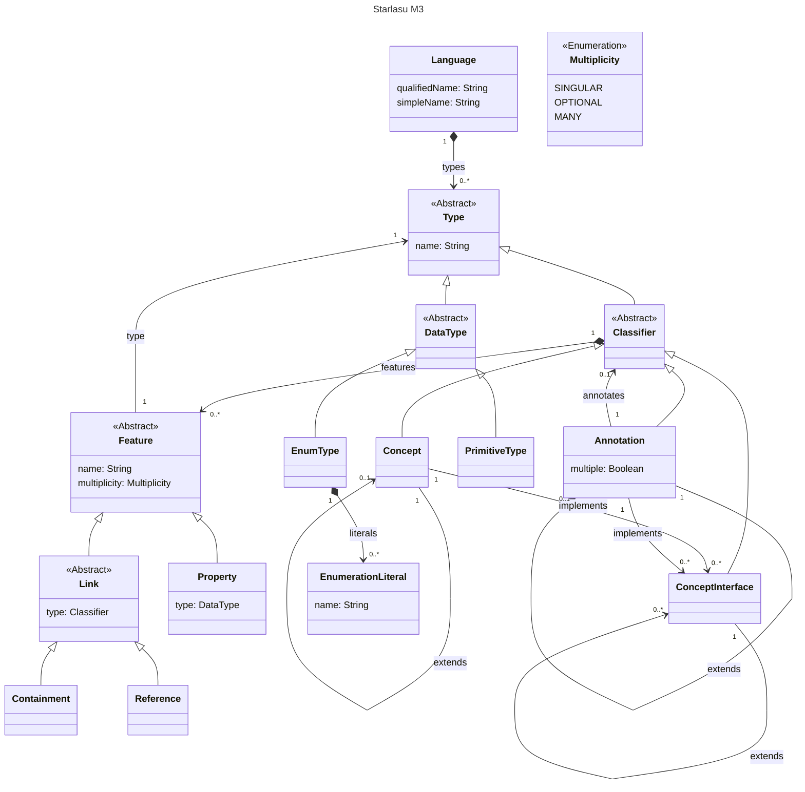

# AST Representation

Starlasu operates on Abstract Syntax Trees (ASTs) (or _Code Models_). These are tree-like data structures to represent 
the information contained in a piece of formal language or “code”. For example, the statements in a procedural program, 
the data elements in a SQL query, or the steps in a business workflow.

All the Starlasu ASTs are based on a few primitive elements.

The structure is similar to the one used by other Modeling solutions such as [EMF](https://eclipse.dev/modeling/emf/), 
[MPS](https://www.jetbrains.com/mps/), or [LionWeb](https://lionweb.io/). 
In particular we aim to (mostly) converge to the same terminology used in LionWeb 
(see the [LioWeb’s specifications](https://lionweb.io/specification/metametamodel/metametamodel.html)).

This is a representation of the whole structure.



***Note that this is the terminology used since Kolasu 1.6. In previous versions of Kolasu and other libraries 
the terminology could be slightly different.***

We call this structure the Meta-Metamodel of Starlasu or the Starlasu’s M3 
(see https://en.wikipedia.org/wiki/Meta-Object_Facility for a definition of M0, M1, M2, and M3).

In our case:

- The M0 or the observed element is the code itself
- The M1 or the model of the code, is an instance of an AST. For example, an actual instance of ClassDeclaration with name *foo*, no fields and no methods
- The M2 or the metamodel is the set of AST classes defined for a certain language, for example the definition of the class ClassDeclaration, describing the fact that a ClassDeclaration has a name, can extend zero or one other ClassDeclarations and can implement zero to many InterfaceDeclarations
- The M3 or the meta-metamodel is the structure that we use to define AST. See the picture above

## Language

- At the top level there is a *Language.* See for example, [KolasuLanguage](https://github.com/Strumenta/kolasu/blob/2fa276186924ec859519d3c87fad6513c23fd74a/core/src/main/kotlin/com/strumenta/kolasu/language/KolasuLanguage.kt#L22)
- A *Language* has a qualified name. It has also a simple name, which is simply the portion of the qualified name following the last dot (or the entire qualified name, if it has no dots)
- A *Language* groups various *Types.*
- *Types* can be either *Concepts, ConceptInterfaces, PrimitiveTypes,* or *EnumTypes*

## Concept, ConceptInterface, Annotation

- A *Concept* can extend zero or one *Concepts*. It can implement zero to many *ConceptInterfaces*
- *Concepts* and *ConceptInterfaces* have a name (because they are *Types*)
- *Concepts* and *ConceptInterfaces* have features
- *ConceptInterfaces* are similar to interfaces in programming languages
- An *Annotation* can extend another *Annotation*. It can implement zero many *ConceptInterfaces*

## Features

- All features have a name and could be either *Properties* or *Links*
- *Multiplicity* is one of: optional (zero or one instances), singular (exactly one instance), or many (zero to many instances). There is not alternative for one or more instances
- *Properties* have a type which is a *DataType*. *Properties* can have multiplicity singular or optional, but not many
- A *Link* is either a *Reference* or a *Containment*
- A *Link* has as type a *Classifier* (either a *Concept* or a *ConceptInterface*)
- A *Reference* can have multiplicity singular or optional, but not many

## Primitive Types

- A *Primitive Type* is anything that is not a *Node* is considered a primitive type. Typically these are Strings, Chars, Ints. This does not include Enums, which are treated separately. Arbitrary other types can be used. They may require additional configuration for example, for serialization.

  For example, consider this class from the RPG Language Module:

    ```kotlin
    // Class _not_ extending Node
    sealed class EditCode {
        ...
    }
    
    data class OutputSpecificationFieldDescription(
        val fieldIndicators: List<Indicator?> = emptyList(),
        val fieldName: FieldNameType,
        // EditCode is used in an AST and it is not a Node neither a 
        // ReferenceValue so it is a PrimitiveType.
        // editCode is a Property, as the value is a PrimitiveType
        val editCode: EditCode? = null,
        val blankAfter: Boolean = false,
        val endPosition: EndPosition? = null,
        val dataFormat: DataFormat = DataFormat.Blank,
        val various: Expression? = null,
        val comments: String? = null
    ) : OutputSpecification(), WithInlineDeclaration
    ```


## Enum Types

These are just types representing a finite set of possibilities.

## Obtaining Concepts from classes

*Concepts* are automatically derived from inspecting classes.

In the case of Kolasu, we inspect all the properties (in the “Kotlin sense” of property) of a Class, 
ignoring the one marked as `@Internal`.

For each property:

- If the type is `ReferenceValue` (previously called `ReferenceByName`), then it indicates a *Reference*
- If the type is a Node or a Node subclass, then it indicates a *Containment*
- If the type a MutableList of Node or a Node subclass, then it indicates a *Containment*
- If the type is anything else, then we have a *Property*

We want to keep this structure as minimal as possible, because in this way it is much easier to support more features such as serialization, transformers, interoperability with LionWeb, etc.

For this reason we do not support sets or maps or other collections.

For example:

```kotlin
// This will produce a Concept named JCompilationUnit
data class JCompilationUnit(
    // This will produce a containment with multiplicity Optional
    val packageDeclaration: JPackageDeclaration? = null,
    // This will produce a containment with multiplicity Many
    val imports: MutableList<JImportDeclaration> = mutableListOf(),
    // This will produce a containment with multiplicity Many
    val declarations: MutableList<JTypeDeclaration> = mutableListOf(),
    // This will produce a containment with multiplicity Optional
    val moduleDeclaration: JModuleDeclaration? = null,
) : Node()

// This will produce a Concept extending the Concept derived 
// from class JAnnotation
data class JSingleElementAnnotation(
    // This will produce a reference with multiplicity Singular
    override val typeName: ReferenceValue<JAnnotationDeclaration>,
    // This will produce a containment with multiplicity Singular
    val value: JExpression,
) : JAnnotation(typeName)
```

# Guidelines on defining ASTs using Kolasu

Now that we understand the Starlasu M3 and we know how it is derived from the Kotlin classes we create, we can see 
how we should write our Kotlin classes to get the M2 (or metamodel or conceptual language) that we want.

We typically specify attributes and single or optional containments with `var` .

We typically specify references and multiple containments with `val` . In that case we can change the content of 
the reference or the list, without the need to reassign them.

## Annotations

The internal annotation can be used to indicate fields that should not appear in the AST

```kotlin
data class RPGPlaceholderExpr(@property:Internal override var placeholderName: String? = null) :
    Expression(), PlaceholderElement {
    @property:Internal
    override val multiplePlaceholderElement: Boolean
        get() = false
}
```

The derived annotation can be used to indicate features that are obtained by processing other features, and that 
can be recalculated from them.

```kotlin
data class CompilationUnit(
    val mainStatements: MutableList<Statement> = LinkedList<Statement>(),
    ...
) : Node(), StatementContainer {
    ...

    @Derived
    val mainRoutine: Subroutine
        get() {
            return Subroutine("VirtualMainRoutine", null, mainStatements, SubroutineCategory.Main)
                .apply {
                    this.origin =
                        SimpleOrigin(mainStatements.firstOrNull()?.position, "").addToOriginNodes(mainStatements)
                }.withParent(this)
        }

```

## Prefix

We typically want to use a prefix for **all** the classes we use to define our language M2. This is useful because 
in transpiler and other applications we may want to combine multiple languages. For example, in a transpiler from RPG to Java we may want to include both the RPG AST classes and the Java AST classes. Both languages could share constructs with the same name, and without a prefix it would be cumbersome to distinguish them.

## Common Concepts

Starlasu includes a few Common *ConceptInterfaces.* They can be used as markers, so that different tooling can look 
for *Concepts* implementing those, and treated them in a special way.

They are:

- **Statement:** it represents a statement in the language (i.e., something that can be executed)
- **Expression:** it represents an expression in the language (i.e., something that can be evaluated and produce a value
- **EntityDeclaration:** it should be used for the definition of classes, interfaces, and structures. These declarations introduces new types. This interface should not be used for parameter declarations or variable declarations.
- **PlaceholderElement:** this indicates special *Concepts* used to represent variability when defining patterns. If you are not building support for patterns in your language, you can ignore them (see [Placeholders](https://www.notion.so/Placeholders-34efa5c5c3df43299ce87bef074b06be?pvs=21))

## How to use Named and PossiblyNamed

*Named* is to be used for things that have **always** a name, *PossiblyNamed* is to be used for things that **may or may not** have name.

For example, in some languages one can define functions and anonymous functions. If we want to represent both with the same Concept, then we can make that Concept implement *PossiblyNamed*.

For a local variable which is guaranteed to have a name (supposing our language do not support anonymous variables) then we would use *Named*.

## When to use ReferenceValue

A *ReferenceByName* indicates that a name can indicate something else, where something else is typically another node in the same AST or another AST or a reference to some external symbol (like a builtin-function).

Examples of usages of *ReferenceByName*:

```kotlin
data class FReferenceExpr(val value: ReferenceByName<FValueDeclaration>) 
    : FExpression

data class FMethodCallExpr(val method: ReferenceByName<FMethodDeclaration>,
    val args: MutableList<FExpression> = mutableListOf()) 
    : FExpression
```

## When to use enums

Enums should be used when we have a set of alternatives. For example:

```kotlin
enum class JVisibility {
   PUBLIC,
   PRIVATE,
   PROTECTED,
   DEFAULT
}

sealed class JClassMember(val visibility: JVisibility): Node()
```

## Modifiers

When representing modifiers we have two alternatives:

- Represent the list of modifiers itself. We tend to do that to preserve the information on the order of the modifiers. This is a lower level representation, more suited for the parse tree than the AST. We should avoid it.
- To represent the modifiers through flags and enums in the declaration to which the modifiers are applied. This is closer to the mental model a developer would have of the code, and this is what we should do.

```kotlin
// To use
data class FMethodDeclaration(val visibility: FVisibility, 
    val isFinal: Boolean, val isStatic: Boolean, 
    val name: String, val body: FBody? = null) : FMember()

// To avoid
data class FMethodDeclaration(val modifiers: MutableList<FModifier>, 
    val name: String, val body: FBody? = null) : FMember()
```

## Statements

We typically define a top level rule to represent all statements of our language:

```kotlin
sealed class FStatement : BaseNode(), Statement 
// here Expression is the common concept we have seen above
```

All other statements should end with the `Stmt` postfix.

### Expression Statements

In most languages methods or other blocks contain list of statements. They cannot contain directly expressions. However expressions can be wrapped in *ExpressionStatements*:

```kotlin
data class FExpressionStmt(val expr: FExpression) : FStatement
```

For example, in Java we may have:

```kotlin
public void foo() {
   // here this entire line, including the semicolon, is an 
   // JExpressionStmt, while the expression 1 + 2, is a JAdditionExpr
   1 + 2; 
}
```

## Expressions

We typically define a top level rule to represent all expressions of our language:

```kotlin
sealed class FExpression : BaseNode(), Expression 
// here Expression is the common concept we have seen above
```

All other expressions should end with the `Expr` postfix.

### Binary expressions

```kotlin
sealed class FBinaryExpr(
   open var left: FExpression, 
   open var right: FExpression)
: FExpression()

// We should NOT do this
// The type of operations should be distinguished through subclasses
// We may well have an operator field in the parse tree, but we should
// not have in the AST
class FBinaryExpr(
   open var left: FExpression, 
   open var right: FExpression,
   val operator: OperatorType)
: FExpression()
```

### Arithmetic expressions

```kotlin
sealed class FArithmeticExpr(
   open var left: FExpression, 
   open var right: FExpression)
: FExpression()

// do **not** call this FSumExpr or FAddExpr
data class FAdditionExpr(
    override var left: FExpression,
    override var right: FExpression)
: FArithmeticExpr()

data class FSubtractionExpr(
    override var left: FExpression,
    override var right: FExpression)
: FArithmeticExpr()

data class FMultiplicationExpr(
    override var left: FExpression,
    override var right: FExpression)
: FArithmeticExpr()

data class FDivisionExpr(
    override var left: FExpression,
    override var right: FExpression)
: FArithmeticExpr()
```

### Comparison expressions

```kotlin
sealed class FComparisonExpr(
	  override var left: FExpression, 
    override var right: FExpression) :
    FBinaryExpr(left, right)

data class FEqualityExpr(
	  override var left: FExpression, 
    override var right: FExpression) :
    FComparisonExpr(left, right)

// do **not** call this FDisequalityExpr
data class FInequalityExpr(
	  override var left: FExpression, 
    override var right: FExpression) :
    FComparisonExpr(left, right)

data class FLessThanExpr(
    override var left: FExpression, 
    override var right: FExpression) :
    FComparisonExpr(left, right)

data class FGreaterThanExpression(
    override var left: FExpression, 
    override var right: FExpression) :
    FComparisonExpression(left, right)

data class FLessOrEqualToExpression(
    override var left: FExpression, 
    override var right: FExpression) :
    FComparisonExpression(left, right)

data class FGreaterOrEqualToExpr(
    override var left: FExpression, 
    override var right: FExpression) :
    FComparisonExpr(left, right)

```

### Logical expressions

```kotlin
// even if the language does not support bitwise and/or expressions
// these name make more obvious what these expressions are 
data class FLogicalAndExpr(
	  override var left: FExpression, 
    override var right: FExpression) :
    FBinaryExpr(left, right)

data class FLogicalOrExpr(
	  override var left: FExpression, 
    override var right: FExpression) :
    FBinaryExpr(left, right)
```

### Field accesses

Field accesses are typically represented like this:

```kotlin
data class FFieldAccessExpr(val container: FExpression,
    val field: ReferenceValue<FFieldDeclaration>) : FExpression()
```

Note that in case of chain of field accesses we would have a recurring structure.

We should **not** aim to represent chains of field accesses as a single expression:

```kotlin
// Do **not** do this
data class FFieldAccessExpr(val parts: List<String>): FExpression()

// Or this, which is not supported by Starlasu as lists of references
// are forbidden
data class FFieldAccessExpr(
	  val parts: List<ReferenceValue<FFieldDeclaration>): FExpression()

// Also this has to be avoided
data class FFieldAccessExpr(
	  val parts: List<FFieldAccessExprPart>): FExpression()
data class FFieldAccessExprPart(
    val field: ReferenceValue<FFieldDeclaration>): Node()
```

Note that we discuss only *qualified* field accesses. So field accesses in the form:

```java
container.field
```

We do not consider *unqualified* field accesses. The reason is that unqualified field accesses are undistinguishable from references to other expressions during parsing. We can distinguish them only during symbol resolution. For this reason unqualified field accesses are represented using reference expressions.

### Function and Method calls

Function and method calls are typically expressions, as they can produce a value:

```kotlin
data class FMethodCallExpr(
    val method: ReferenceValue<FMethodDeclaration>,
    val args: MutableList<FExpression> = mutableLisOf())
    : FExpression() 
```

These represents method calls where the receiver (the thing on which the method is invoked) is not specified.

```kotlin
myMethod() // simple or unqualified method call, see this section
myReceived.myMethod() // qualified method call, see next section
```

If both qualified and unqualified method calls are possible, a single abstract parent class should be used. It should contain the `method` and `args` parameters specified here.

### Qualified method calls

These represents method calls where the receiver (the thing on which the method is invoked) is specified.

```kotlin
myMethod() // simple or unqualified method call, see previous section
myReceived.myMethod() // qualified method call, see this section
```

This is how they can be represented:

```kotlin
data class FQualifiedMethodCallExpr(
    var container: FExpression, 
    override val method: ReferenceValue<FMethodDeclaration>,
    override val args: MutableList<FExpression> = mutableLisOf())
    : FMethodCall() 
```

We discourage having a single AST class to represent both unqualified and qualified method calls, by making the container optional.

### Unary expressions

```kotlin
data class FNegatedExpr(val base: FExpression): FExpression()
data class FMinusExpr(val base: FExpression): FExpression()
```

## Method definitions

```kotlin
data class FMethodDeclaration(
    override var name: String,
    val params: MutableList<FParameterDeclaration>, 
    // body is null for abstract methods. We want to distinguish
    // between abstract methods and methods with an empty body
    var body: FBody? = null) : FClassMember(), Named
```

## Partitions

Partitions are special constructs needed for LionWeb interoperability to represent collections of ASTs.

They are *not* represented as Kolasu nodes (the annotation *LionWebPartition* has been removed)

## Placeholders

Placeholders are used to create patterns:

```kotlin
data class RPGPlaceholderExpr(@property:Internal override var placeholderName: String? = null) :
    Expression(), PlaceholderElement {
    @property:Internal
    override val multiplePlaceholderElement: Boolean
        get() = false
}

data class RPGPlaceholderMultiStmt(@property:Internal override var placeholderName: String? = null) :
    Statement(), PlaceholderElement {
    @property:Internal
    override val multiplePlaceholderElement: Boolean
        get() = true
}

```

Why do we need pattern? To match ASTs or produce following a certain structure. Consider this example:

```kotlin
this.statementByExample<ForStatement>(
"""     C                   FOR       I = `expr:s` TO `expr:e`
        C                   `stmt*:b`
        C                   ENDFOR""",
"""for (int I = `expr:s`;I <= `expr:e`;I++) { `stmt*:b` }""",
variants= listOf("I")
)
```

This piece of code:

- Match in an RPG AST every for statement defining a variable called I, *irrespectively of what the starting and ending expressions are and irrespectively of the statements it contains*
- It then produce a piece of Java code, filling in the translation of the corresponding elements captured in the RPG code

For example, if we parse:

```kotlin
     C                   FOR       I = 1 TO 2
     C      "hello"      DSPLY     
     C      "world"      DSPLY      
     C                   ENDFOR
```

The output Java code would be:

```java
for (int I = 1;I <= 2;I++) { 
	System.out.println("hello");
	System.out.println("world");
}
```

In order to represent “AST with holes” we use the placeholder parsing rules and the placeholder AST elements.

A demo of this feature is presented in this video: [Let's talk about transpilers](https://youtu.be/d-ulE5Trb0s?t=1754).