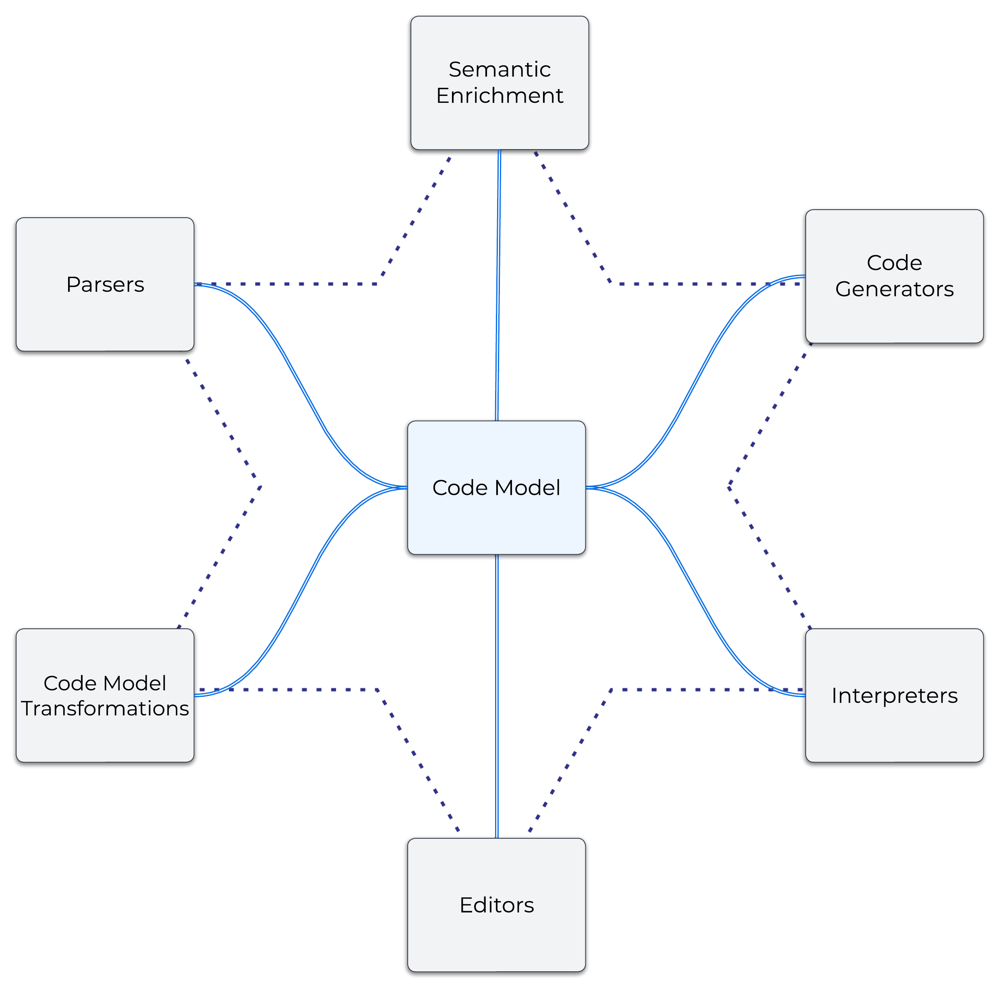

# The Starlasu Approach

The Starlasu approach provides a flexible, systematic, and extensible framework for creating tools like parsers, 
transpilers, code analyzers, interpreters, code generators, and domain-specific languages (DSLs). 

The Starlasu approach was developed at [Strumenta](https://strumenta.com), drawing on a decade of experience in Language 
Engineering projects. 
It reflects lessons learned about what works and what doesn’t, 
combining this expertise to deliver reliable and adaptable language processing systems.

## What can you do with The Starlasu approach?

The goal is to be able to define arbitrary Language Engineering applications, and flexibility is the main goal
of this approach.

Concretely, the most common applications we write using these methods are:
1. **Domain-Specific Languages (DSLs)**: We define new tailored languages for specific domains with accompanying editors and execution engines (either interpreters or code generators).
2. **Transpilers**: Applications that translate code from one language to another. Typically from a legacy language such as RPG to a modern one such as Java.
3. **Parsers**: Tools that generate Code Models for code analysis, documentation generation, or as the initial step of 
transpilers. We typically implements these Parsers that are then used to build code analysis tools, transpilers, or other systems. 

## Architectural Overview

The Starlasu approach is centered around the idea of **Code Model**. 
We have this component at the center and a constellation of other components interacting with it.

### The Code Model (or AST)
The **Code Model** represents a representation of the information present in the code, in a form that facilitates
reasoning about it and processing. It facilitates reasoning by being close to the mental model a developer would 
have of the code and it facilitates processing through the [dualistic homogeneous and heterogeneous APIs](DualCodeModelAPIs.md).

The Code Model is an evolution of the Abstract Syntax Tree (AST).

### Surrounding Components
Around this central model, there are several essential components:
- **Parsers**: These components process code, and "understand it". This understanding is defined as the Code Model.
- **Code Generators**: These components produce code according to a Code Model.
- **Code Model Transformations**: These components produce a different Code Model, from an original Code Model.
- **Editors**: These components permit to edit code, either through textual, graphical, or projectional editors. 
They provide Language Intelligence by using the underlying Code Model
- **Semantic Enrichment**: These components analyze a Code Model performing symbol resolution and type calculation over it,
 and adding additional metadata to the original Code Model. 
- **Interpreters**: They permit the execution of Code Models

These components work in a star-like configuration around the AST, emphasizing modularity

### Combining Components

The components we just examined can be combined into different pipelines for different goals. 
E.g., a parser will transform a lower-level parse tree into a higher-level AST, then perhaps resolve names 
and references, and type-check the code. A transpiler will also perhaps transform the source code into some 
intermediate representation, then into the target language AST, from which it will generate the resulting 
code string.

## What one gets from Starlasu?

Starlasu consists of a mental framework and guidelines to build the different component. For example, we have a detailed
method to design and implement parsers (see [The Chisel Method](ChiselMethod.md)).

One also gets a family of libraries, all built around the same principles but for different programming languages. In this
way one can conveniently use the Starlasu when programming in a multitude of programming languages.

Starlasu is supported by a family of libraries, each supporting the application of The Starlasu approach on 
different platforms:
- **Kolasu**: For the JVM (Java, Kotlin), expanding to Node.js and browser environments in version 1.6.
- **Tylasu**: For Node.js and browser environments.
- **Pylasu**: For Python.
- **Sharplasu**: For .NET.

These libraries share a common architecture and are interoperable. This enable cross-platform development and 
consistent tooling.

### Feature Matrix

Let's see more in detail what each library of the Starlasu family provides.
Below is a detailed matrix of the features provided by each of them:

| Feature                                      | Kolasu   | Tylasu          | Sharplasu         | Pylasu          |
|----------------------------------------------|----------|-----------------|-------------------|-----------------|
| [AST Representation](ASTRepresentation.md)   | Stable   | Stable          | Stable            | Stable          |
| [Semantic Enrichment](SemanticEnrichment.md) | Complete | Not implemented | Complete          | Not implemented |
| Code Generation                              | Stable   | Not implemented | Under development | Not implemented |
| Parser Integration                           | Stable   | Stable          | Stable            | Stable          |
| Editor Support                               | Partial  | Partial         | Not implemented   | Not implemented |
| Interoperability                             | Stable   | Stable          | Partial           | Partial         |
| AST Traversal and Querying                   | Stable   | Stable          | Stable            | Stable          |
| Transformation Framework                     | Stable   | Stable          | Stablee           | Stable          |
| AST Documentation                            | Stable   | Stable          | Stable            | Stable          |
| Testing                                      | Stable   | Stable          | Stable            | Stable          |     
| Validation                                   | Stable   | Stable          | Stable            | Stable          |

Where:
* **Stable** means that the functionality has been used in many projects and it is not expected to change
* **Complete** means that the functionality has been implemented. It has been validated but it could futher evolve
* **Partial** a portion of the features of the functionality have been implemented
* **Under development** the functionality is currently under development
* **Not implemented** the functionality is not implemented

## Why the name Starlasu?

Starlasu combines the concept of a star and the shortand for language support. Why a star? To indicate the fact that we 
have at the center one element (the code model), and everything else operates on it either producing code models, 
refining code models or consuming code model.

## Origin of The Starlasu approach
The Starlasu approach originated from Strumenta’s commitment to simplifying and standardizing language engineering.
In other words, we were not particularly keen reinventing the wheel and doing the same mistakes over and over, so we 
wanted to capture what we learned in one-hundred or so language engineering projects to overcome the typical pitfalls,
get a design that was extensible, and that permitted to get where we want as fast and uneventfully as possible.

To achieve that we distilled common patterns into reusable principles and libraries. These ideas have been influenced 
by the background of each of us, and draw on experience from the Eclipse Modeling Framework community, 
Model Driven Engineering, Projectional Editing and the work of giants in the community such as Markus Völter, Meinte Boersma,
Jos Warmer, Sascha Lißon and others.
